# Missão Zero Tela — Criativos para anúncios

> **Big Idea:** O problema não é a tela. É o vazio de ideias quando você desliga ela.

Este pacote tem as peças estáticas prontas para subir (PNG), o código que as gera e o texto de cada anúncio. Os vídeos narrados da leva L1 estão em `levas/L1`.

```
missao-zero-tela/
├── png/
│   ├── feed/        7 estáticos 1080x1350 (4:5) — Feed Instagram/Facebook
│   ├── stories/     2 estáticos 1080x1920 (9:16) — Stories/Reels
│   └── carrossel/   6 slides 1080x1350 (4:5)
├── html/            HTML-fonte de cada peça (abre no navegador)
├── src/             gerador (build.mjs) + ilustrações em SVG (illustrations.mjs)
├── fonts/           Baloo 2 + Nunito + Caveat (Google Fonts, licença OFL)
└── levas/L1/        15 vídeos narrados (teste de copy 3 ganchos x 5 corpos)
```

**Regerar as imagens** (depois de editar textos em `src/build.mjs`):

```bash
npm install
node src/build.mjs             # tudo
node src/build.mjs feed-03     # só as peças cujo nome contém "feed-03"
```

---

## 1. Identidade visual usada

A mesma da página de vendas, para o anúncio e a página parecerem uma coisa só.

| Elemento | Escolha |
|---|---|
| Paleta | Amarelo-sol `#FFD23F` · Azul-marinho `#1E2A4A` · Vermelho-giz `#E5483B` · Verde `#1F9D55` · Azul `#2F6FDE` · Céu `#EAF3FF` |
| Tipografia | **Baloo 2** (títulos) + **Nunito** (textos) + **Caveat** (fala da criança, letra de mão) |
| Elementos | Cartas de missão com traço grosso e sombra deslocada, balão de fala "Mãe, só mais um vídeo?", selo "100 missões", carimbo "Missão cumprida", folha de caderno |
| Evitado | Criança triste em destaque, tom de culpa, estética de clínica ou de "vício" |

---

## 2. Estáticos de Feed (4:5)

Para cada peça: **Texto principal** (acima da imagem), **Título** (abaixo da imagem), **Descrição** e **Botão**.

### feed-01 — Ângulo "Só mais um vídeo" (a fala do filho)
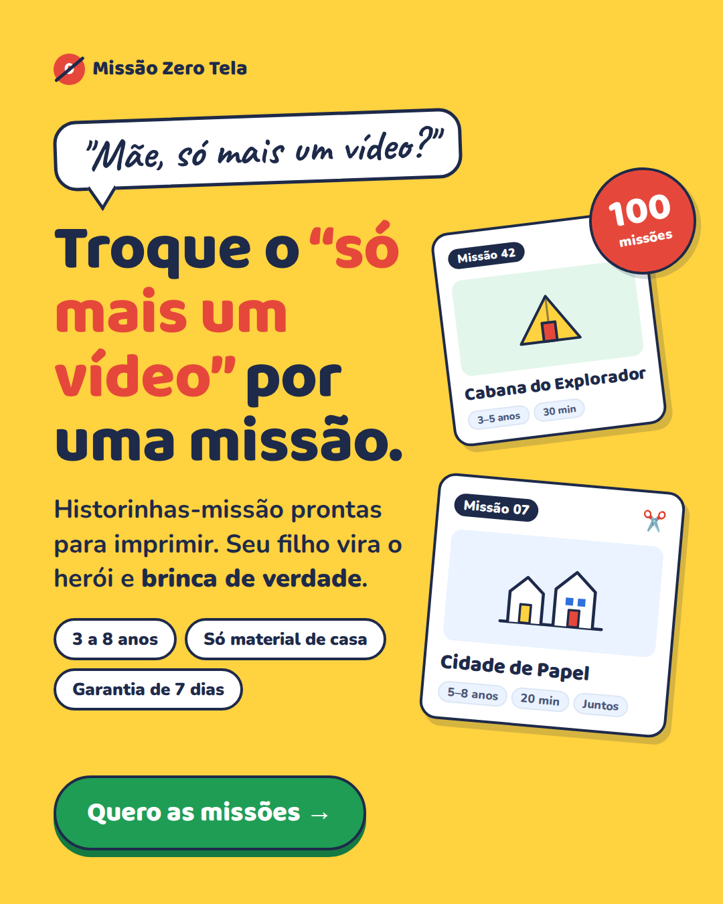

- **Texto principal:**
  > "Mãe, só mais um vídeo?" 📱
  >
  > Se essa frase toca aí todo dia, você não está sozinha.
  >
  > O Missão Zero Tela troca o "só mais um vídeo" por historinhas-missão prontas para imprimir. Seu filho lê a historinha, vira o herói, aceita a missão e brinca de verdade, com papel, giz, caixa ou lençol.
  >
  > Para crianças de 3 a 8 anos. 👉 Toque em "Saiba mais".
- **Título:** Troque a tela por uma missão
- **Descrição:** 100 historinhas-missão para imprimir
- **Botão:** Saiba mais

### feed-02 — Ângulo "O problema não é a tela" (a crença errada / Big Idea)
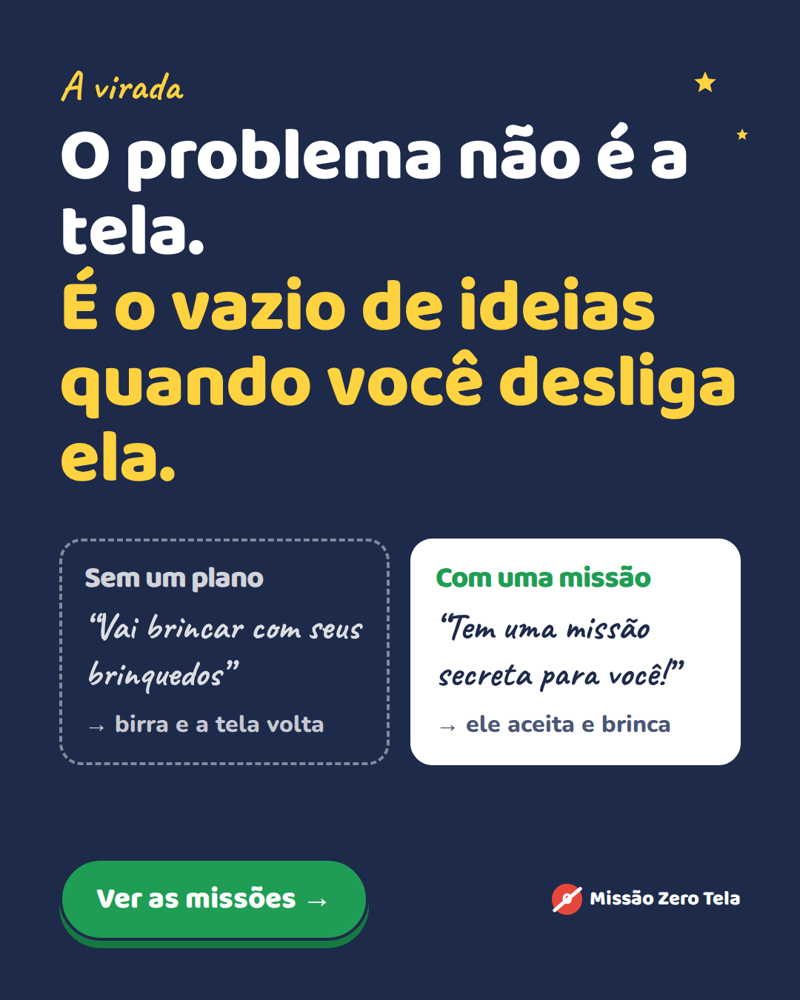

- **Texto principal:**
  > O problema não é a tela. É o vazio de ideias quando você desliga ela. 💡
  >
  > A criança não troca o desenho por "vai brincar com seus brinquedos". Ela troca por um convite irresistível.
  >
  > No Missão Zero Tela, cada brincadeira começa com uma historinha em que seu filho é o herói. Você lê o convite, ele aceita a missão e a brincadeira começa.
  >
  > Veja as missões 👇
- **Título:** O problema não é a tela
- **Descrição:** É o que oferecer no lugar
- **Botão:** Saiba mais

### feed-03 — Ângulo "Tirou o celular e veio a birra?" (a cena da dor)
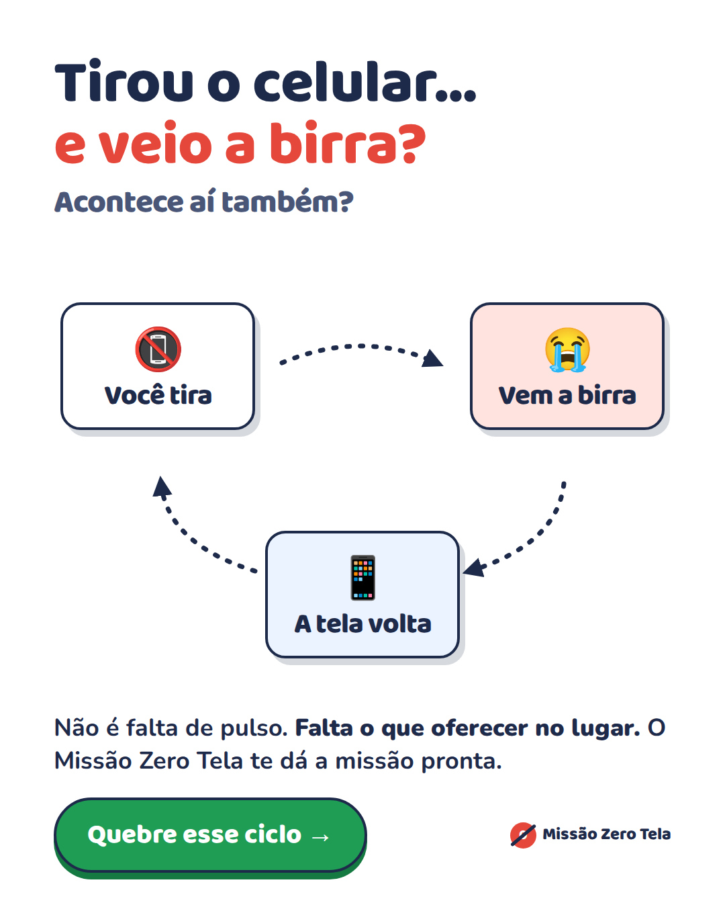

- **Texto principal:**
  > Você tira o celular, vem a birra… e em 10 minutos a tela volta. 🔁
  >
  > Se isso acontece na sua casa, não é falta de pulso. Muitas vezes falta ter o que oferecer no lugar, na hora H.
  >
  > O Missão Zero Tela te dá essa resposta pronta: 100 missões com historinha, idade, tempo e material de casa já indicados.
- **Título:** Quebre o ciclo da birra pela tela
- **Descrição:** Uma missão pronta para a hora H
- **Botão:** Saiba mais

### feed-04 — Ângulo "O dia inteiro" (formato nativo de conversa)
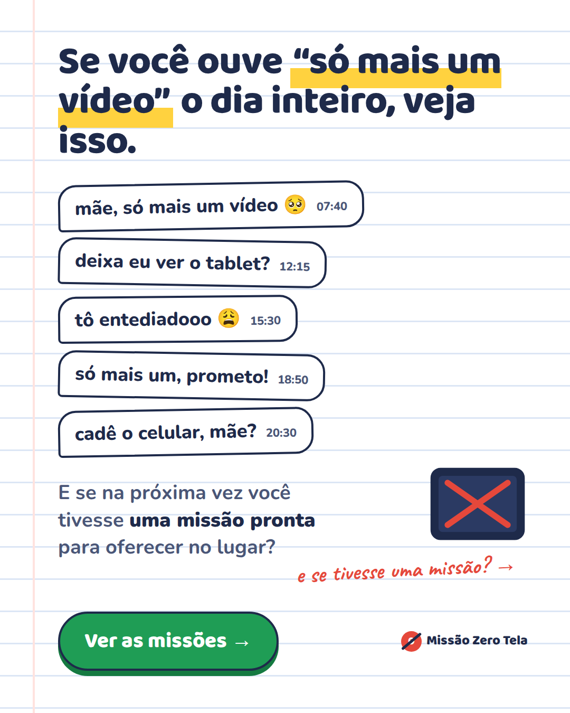

- **Texto principal:**
  > De manhã, no almoço, à tarde, antes do banho… "só mais um vídeo". 🥱
  >
  > E quando você desliga, vem o "tô entediado".
  >
  > E se na próxima vez você tivesse uma missão pronta para oferecer? O Missão Zero Tela tem 100, organizadas por momento do dia: dia de chuva, hora do jantar, viagem, antes de dormir.
- **Título:** Cansada de ouvir "só mais um vídeo"?
- **Descrição:** 100 missões para trocar pela tela
- **Botão:** Saiba mais

### feed-05 — Ângulo "Por dentro de uma missão" (como funciona)
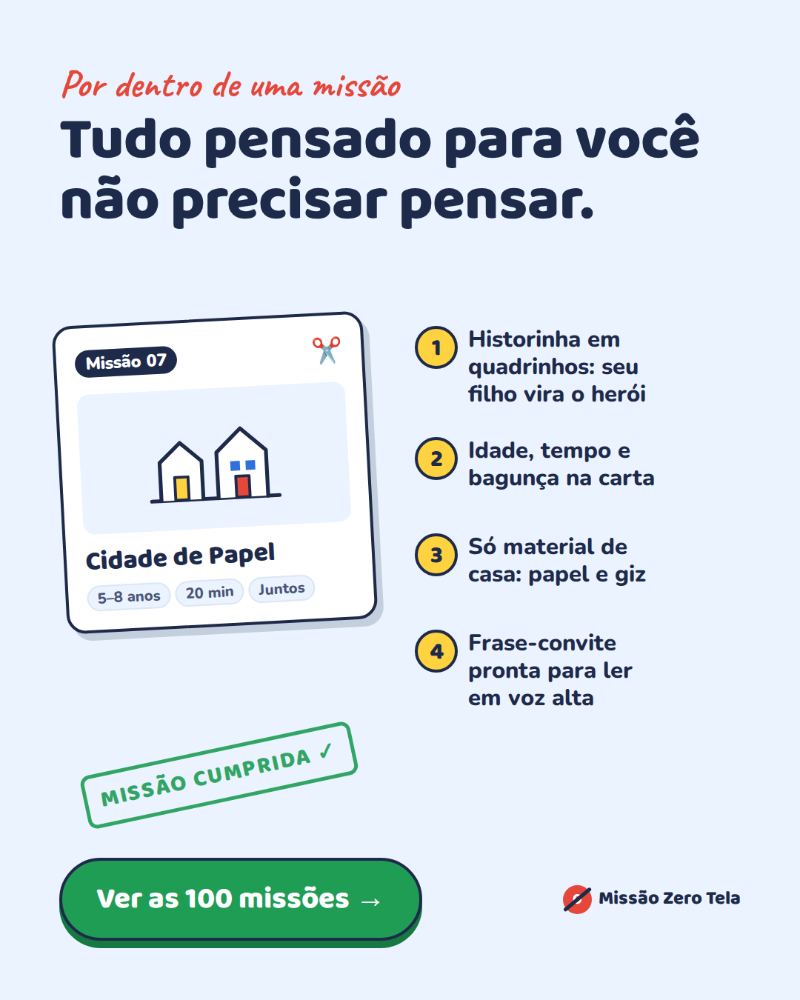

- **Texto principal:**
  > Tudo pensado para você não precisar pensar. ✂️
  >
  > Cada missão traz uma historinha em quadrinhos em que seu filho vira o herói, a idade e o tempo da brincadeira, quanto de bagunça ela faz, o material (só coisas de casa) e uma frase-convite para você ler em voz alta.
  >
  > Missão cumprida vira carimbo no Passaporte do Explorador. 🏅
- **Título:** Veja como é uma missão por dentro
- **Descrição:** Idade, tempo e material na carta
- **Botão:** Saiba mais

### feed-06 — Ângulo "Só com o que tem em casa" (facilidade e tempo)
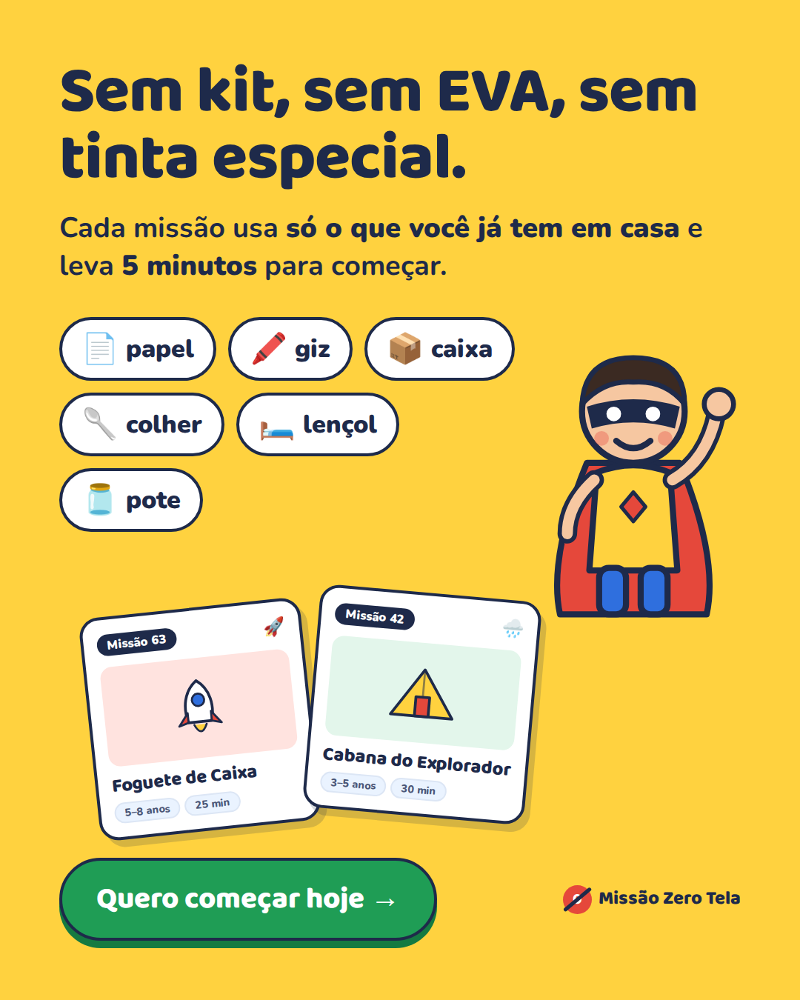

- **Texto principal:**
  > Sem kit, sem EVA, sem tinta especial. 🖍️
  >
  > As missões usam papel, giz, caixa, colher, lençol e pote. Leva 5 minutos para começar, e tem missão para ele fazer sozinho enquanto você faz o jantar.
  >
  > Conheça o Missão Zero Tela 👉
- **Título:** Brincadeira com o que você já tem em casa
- **Descrição:** 5 minutos para começar
- **Botão:** Saiba mais

### feed-07 — Ângulo "Oferta"


- **Texto principal:**
  > 100 historinhas-missão + 4 bônus por R$ 27,90. 🎁
  >
  > ✔ Separadas por idade: 3–4, 5–6 e 7–8 anos
  > ✔ Organizadas por momento do dia
  > ✔ Pote de Missões, Passaporte do Explorador e certificado
  > ✔ Guia "Desligar sem birra" e Desafio 30 Dias Zero Tela
  >
  > PDF para imprimir ou usar no celular, acesso imediato no e-mail e 7 dias de garantia.
- **Título:** 100 missões + 4 bônus por R$ 27,90
- **Descrição:** Acesso imediato · garantia de 7 dias
- **Botão:** Comprar agora (ou Saiba mais)

---

## 3. Stories / Reels (9:16)

As peças respeitam as áreas seguras (250 px no topo e 340 px na base livres de texto importante).

| Peça | Ângulo | Texto principal sugerido |
|---|---|---|
| 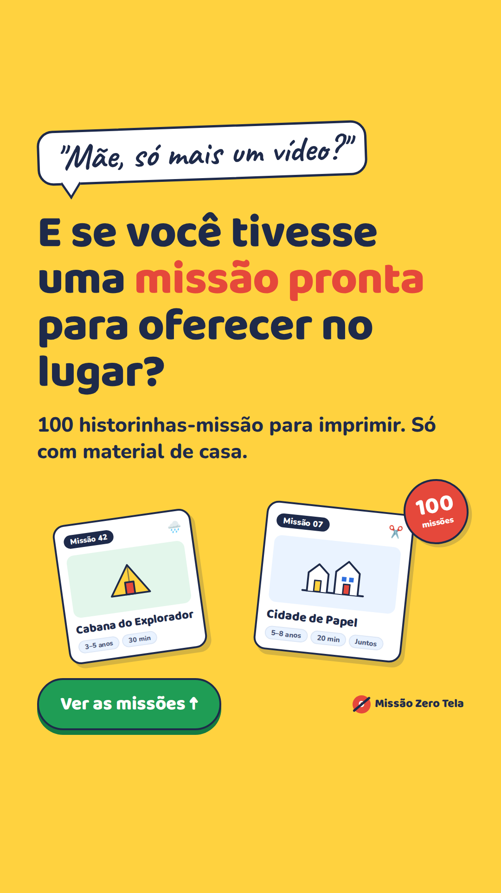 | Só mais um vídeo | "Mãe, só mais um vídeo? 📱 E se você tivesse uma missão pronta para oferecer no lugar? Conheça o Missão Zero Tela." |
| 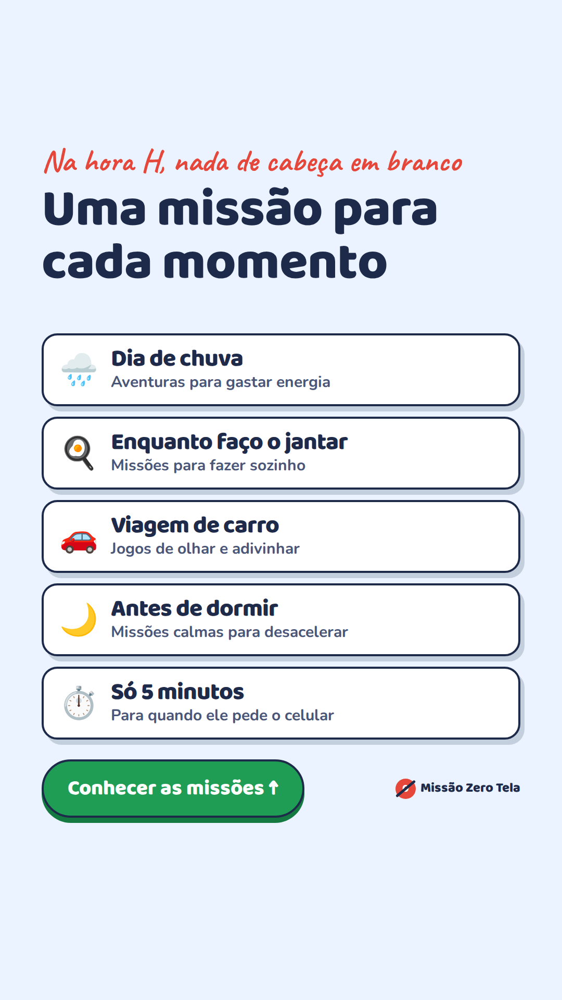 | Uma missão para cada momento | "Dia de chuva, jantar, viagem, antes de dormir: tem missão pronta para cada hora. 100 historinhas-missão para imprimir." |

---

## 4. Carrossel (6 slides)

| 1 | 2 | 3 |
|---|---|---|
| 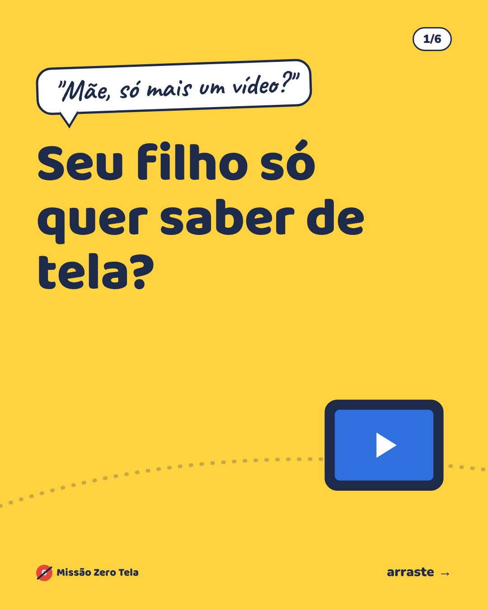 | 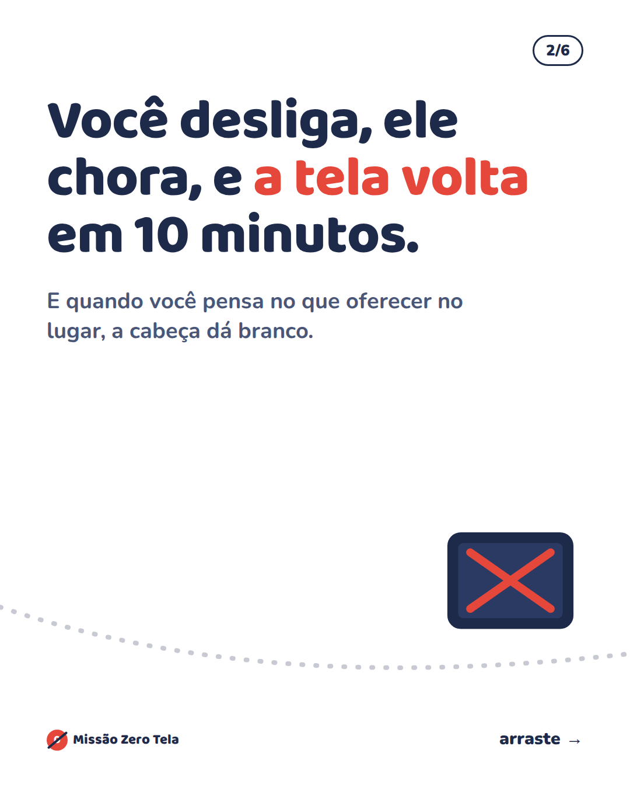 | 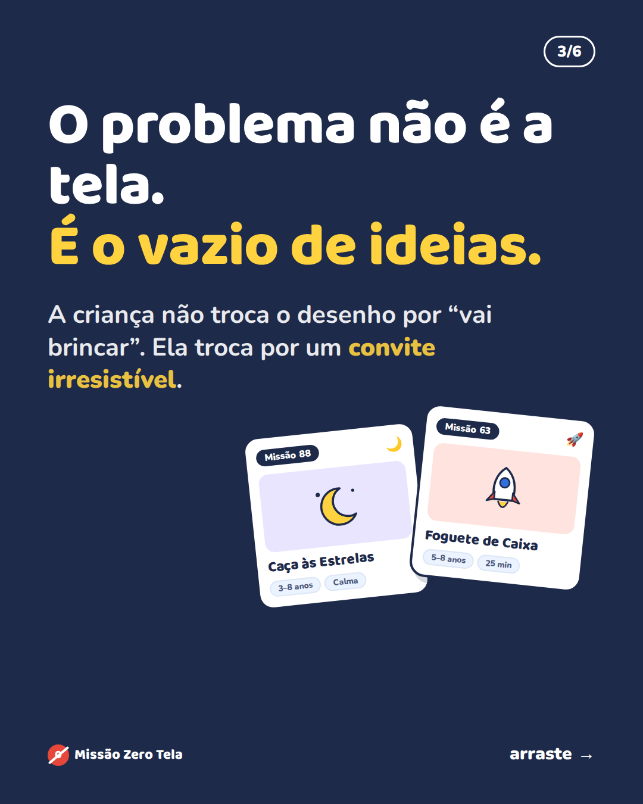 |
| **4** | **5** | **6** |
| 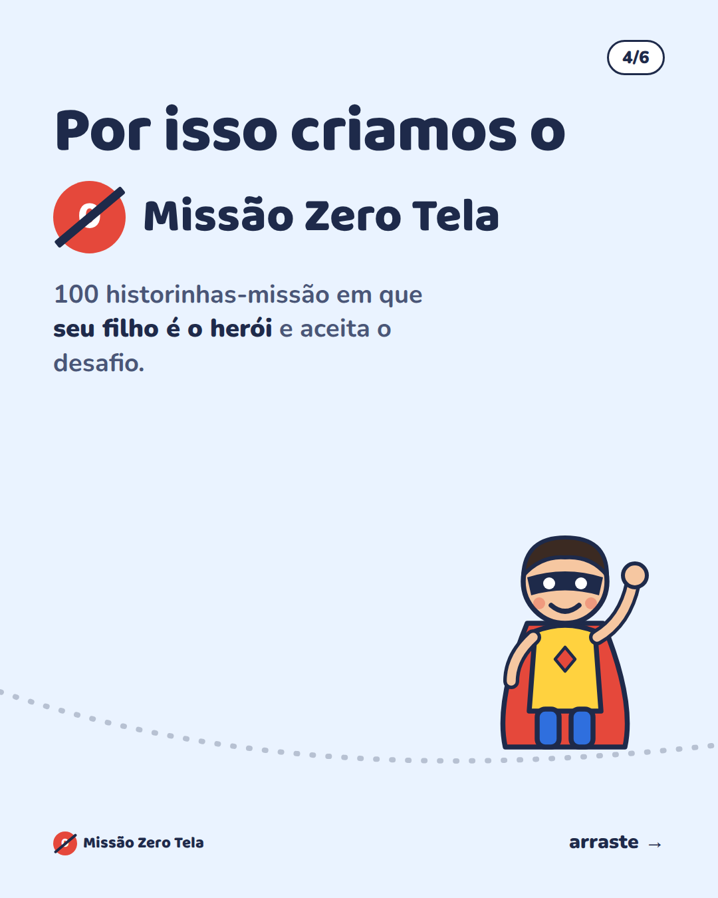 | 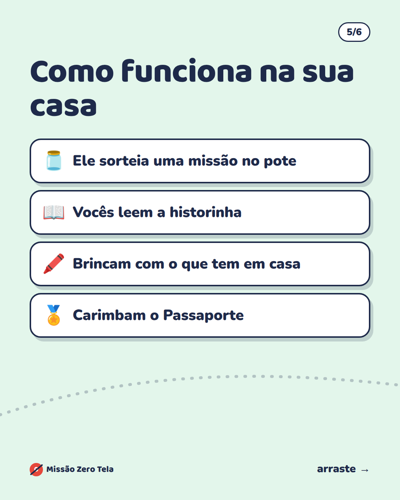 | 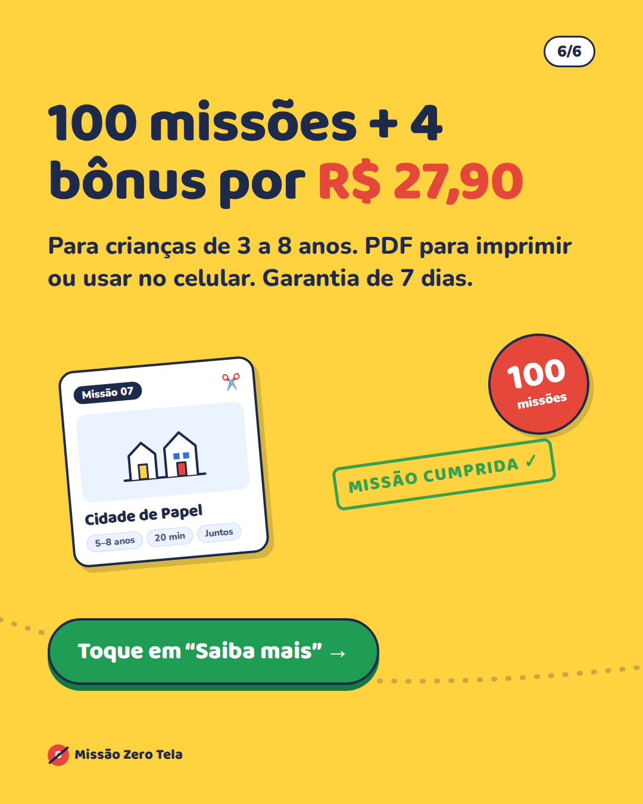 |

A trilha pontilhada atravessa os slides e dá continuidade ao arrastar.

- **Legenda/Texto principal:**
  > Seu filho só quer saber de tela? Arraste para o lado 👉
  >
  > O problema não é a tela. É o vazio de ideias quando você desliga ela. A criança não troca o desenho por "vai brincar", ela troca por um convite.
  >
  > Por isso criamos o Missão Zero Tela: 100 historinhas-missão em que seu filho é o herói, com material de casa. 100 missões + 4 bônus por R$ 27,90, com 7 dias de garantia. Toque em "Saiba mais".
- **Título:** Conheça o Missão Zero Tela
- **Botão:** Saiba mais

---

## 5. Banco de hooks (para testes A/B)

**Identificação / dor**
1. "Mãe, só mais um vídeo?"
2. Tirou o celular e veio a birra?
3. Você desliga, ele chora, e a tela volta em 10 minutos.
4. Se você ouve "só mais um vídeo" o dia inteiro, veja isso.
5. Na hora de tirar a tela, sua cabeça dá branco?
6. Seu filho diz "tô entediado" cinco minutos depois de largar o tablet?
7. Você entrega a tela para fazer o jantar e depois bate a culpa?

**Nova perspectiva / curiosidade**
8. O problema não é a tela. É o vazio de ideias quando você desliga ela.
9. A criança não troca o desenho por "vai brincar". Ela troca por um convite.
10. E se, em vez de "vai brincar", você dissesse "tem uma missão secreta para você"?
11. O segredo para desligar a tela sem guerra pode estar numa historinha.

**Solução / facilidade**
12. 100 missões para trocar pela tela, só com material de casa.
13. Sem kit, sem EVA, sem tinta especial.
14. Uma missão pronta para cada momento do dia.
15. 5 minutos para começar. Seu filho vira o herói.

## 6. Headlines (campo "Título" do anúncio — até ~40 caracteres)

- Troque a tela por uma missão
- O problema não é a tela
- Cansada de ouvir "só mais um vídeo"?
- Uma missão pronta para a hora H
- Brincadeira com o que tem em casa
- 100 missões + 4 bônus por R$ 27,90

## 7. Plano de testes A/B sugerido

Teste uma variável por vez. Orçamento igual por conjunto, mesmo público, 3 a 5 dias antes de decidir.

| Rodada | O que testar | Peças |
|---|---|---|
| 1 — Ângulo | Qual ideia gera mais clique | feed-01 (só mais um vídeo) × feed-02 (não é a tela) × feed-03 (birra) × feed-04 (o dia inteiro) × feed-05 (por dentro) × feed-06 (material de casa) |
| 2 — Formato | Com o ângulo vencedor | estático × carrossel × stories × vídeo narrado (leva L1) |
| 3 — Oferta | Mostrar o preço ou não | ângulo vencedor × feed-07 (oferta) |
| 4 — Hook | Mesmo criativo, 3 a 5 hooks no texto principal | hooks da seção 5 do mesmo grupo do ângulo vencedor |

Métricas para decidir: CTR (link), custo por clique e, principalmente, custo por compra.

## 8. Checklist de conformidade (antes de subir)

- [ ] Sem promessas absolutas: nada de "seu filho nunca mais vai pedir o celular", "garantido", "em 7 dias".
- [ ] Sem alegação de saúde ou desenvolvimento com prazo; o produto não substitui pediatra ou psicólogo.
- [ ] Sem linguagem de culpa ou medo ("seu filho está viciado", "você está prejudicando").
- [ ] Depoimentos só se forem reais e autorizados (a página ainda não tem nenhum).
- [ ] **Conferir as missões de exemplo:** as cartas "Missão 42 Cabana do Explorador", "Missão 15 Detetive de Cores" e "Missão 07 Cidade de Papel" vêm da página de vendas. As cartas **"Missão 63 Foguete de Caixa"** (feed-06, carrossel-03) e **"Missão 88 Caça às Estrelas"** (carrossel-03) foram criadas para ilustrar: troque pelo número e nome de missões reais do PDF em `src/build.mjs` (objeto `cards`) e rode o build de novo.

---

## 9. Modelo com foto (2:3)

Peça no estilo "foto real + lista + mockup do produto" (`png/modelo/`), gerada por `src/modelo.mjs`.

```bash
node src/modelo.mjs fotos/minha-foto.jpg   # com a foto da criança
node src/modelo.mjs                        # sem foto: mostra o espaço reservado
```

A foto fica à direita (680 x 1180 px visíveis, corte automático). Use foto própria, de banco com licença comercial ou gerada por IA. Evite foto de criança real tirada da internet sem autorização.

Formatos (quinto argumento):

```bash
node src/modelo.mjs fotos/modelo-02.jpg modelo-02-menino-celular-feed-4x5 curto 4x5      # feed (sem o bloco de apoio e sem a barra de baixo)
node src/modelo.mjs fotos/modelo-02.jpg modelo-02-menino-celular-stories-9x16 curto 9x16 # stories (respeita as áreas do perfil e do botão)
```

Use o 4:5 no feed: imagens mais altas são cortadas pelo Instagram/Facebook.

Versão horizontal 1,91:1 (1200x628), para anúncio de link no feed:

```bash
node src/modelo-horizontal.mjs fotos/modelo-02.jpg modelo-02-menino-celular-1.91x1
```
