# Tchau Chupeta — Criativos para anúncios

> **Big Idea:** Não é só tirar a chupeta. É ensinar a criança a se despedir dela.

Este pacote tem as peças visuais prontas para subir (PNG), o código que as gera e o banco de copies (textos, hooks, headlines, roteiros UGC e plano de testes A/B).

```
tchau-chupeta/
├── png/
│   ├── feed/        7 estáticos 1080x1350 (4:5) — Feed Instagram/Facebook
│   ├── stories/     2 estáticos 1080x1920 (9:16) — Stories/Reels
│   └── carrossel/   6 slides 1080x1350 (4:5)
├── html/            HTML-fonte de cada peça (abre no navegador)
├── src/             gerador (build.mjs) + ilustrações em SVG (illustrations.mjs)
└── fonts/           Baloo 2 + Nunito (Google Fonts, licença OFL)
```

**Regerar as imagens** (após editar textos em `src/build.mjs`):

```bash
npm install
node src/build.mjs             # tudo
node src/build.mjs feed-03     # só as peças cujo nome contém "feed-03"
```

---

## 1. Identidade visual usada

| Elemento | Escolha |
|---|---|
| Paleta | Creme `#FFF7EE` · Pêssego `#FFB59E` · Lavanda `#C9B8F2` · Menta `#A9DEC9` · Amarelo-estrela `#FFD66B` · Noite `#3B3470` · Texto `#3A3563` |
| Tipografia | **Baloo 2** (títulos — arredondada, infantil) + **Nunito** (textos — leve e legível) |
| Mascote | **Chupi**, a chupeta com rostinho que acena "tchau" — personifica a *despedida* (e não a proibição) |
| Cenários | Céu noturno com lua e estrelas (despedida/sono), família abraçada (acolhimento), trilha pontilhada (passo a passo) |
| Evitado | Estética médica/hospitalar, criança triste ou "problemática", vermelho de alerta |

---

## 2. Estáticos de Feed (4:5)

Para cada peça: **Texto principal** (acima da imagem), **Título** (abaixo da imagem), **Descrição** e **Botão**.

### feed-01 — Ângulo "Não é só tirar"
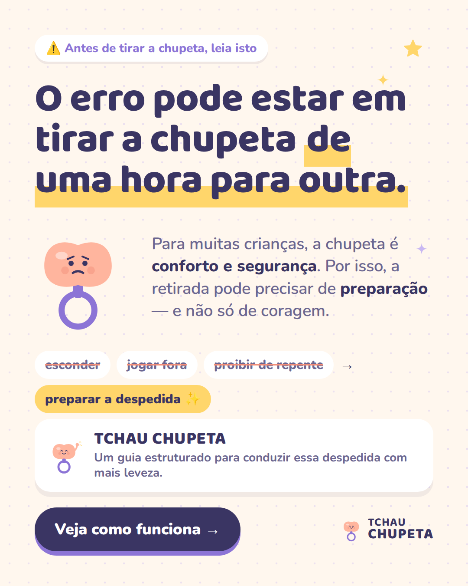

- **Texto principal:**
  > O erro pode estar em tirar a chupeta de uma hora para outra. 👀
  >
  > Para muitas crianças, a chupeta é conforto e segurança. Por isso, esconder, jogar fora ou proibir de repente costuma virar choro, birra… e a chupeta de volta.
  >
  > O Tchau Chupeta é um guia passo a passo que ajuda você a preparar a criança e conduzir uma despedida mais leve — respeitando o ritmo de cada criança. 💛
  >
  > 👉 Toque em "Saiba mais" e veja como funciona.
- **Título:** Não é só tirar. É se despedir.
- **Descrição:** Guia passo a passo para pais
- **Botão:** Saiba mais

### feed-02 — Ângulo "A despedida" (Big Idea)
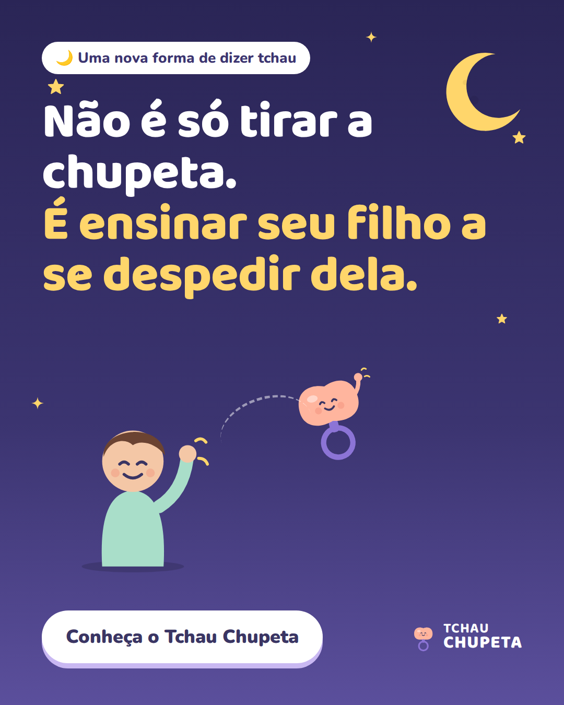

- **Texto principal:**
  > E se o segredo para seu filho largar a chupeta não fosse simplesmente tirar? 🌙
  >
  > No Tchau Chupeta, a retirada vira uma despedida: a criança é preparada, entende que uma mudança está acontecendo e participa desse momento.
  >
  > Menos "você não vai mais usar" e mais "vamos dizer tchau juntos".
  >
  > Conheça o Tchau Chupeta ✨
- **Título:** Uma nova forma de dizer tchau à chupeta
- **Descrição:** Lúdico, acolhedor e estruturado
- **Botão:** Saiba mais

### feed-03 — Ângulo "Tentativa frustrada" (o ciclo)
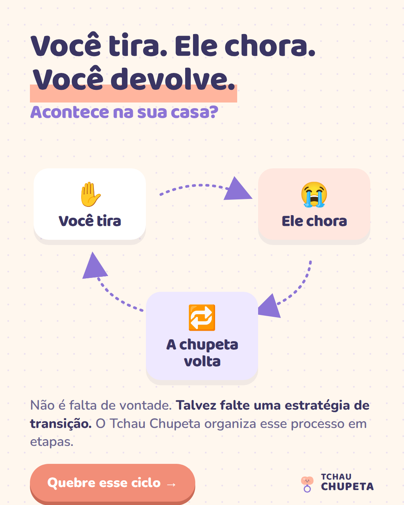

- **Texto principal:**
  > Você tira a chupeta. Seu filho chora. Você não aguenta e devolve. 🔁
  >
  > Se isso acontece na sua casa, você não está sozinha — e não é falta de vontade.
  >
  > Muitas vezes o que falta é uma estratégia de transição: saber o que fazer antes, durante e depois da despedida.
  >
  > O Tchau Chupeta organiza esse processo em etapas, para você conduzir com mais segurança.
- **Título:** Quebre o ciclo do "tira e devolve"
- **Descrição:** Um passo a passo para conduzir a transição
- **Botão:** Saiba mais

### feed-04 — Ângulo "Para mães cansadas" (formato nativo de conversa)
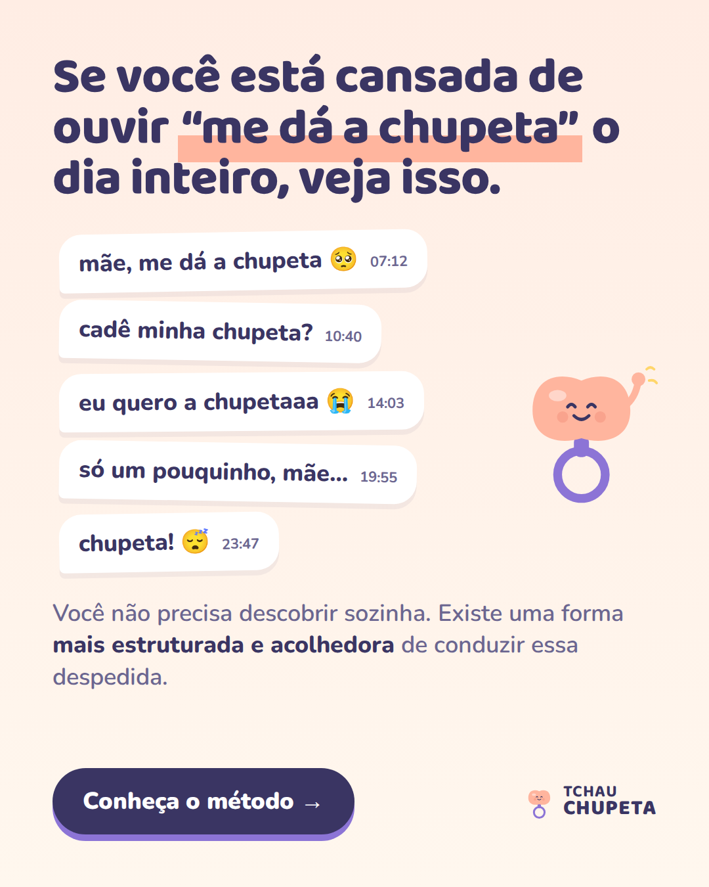

- **Texto principal:**
  > Se você está cansada de ouvir "me dá a chupeta" o dia inteiro, veja isso. 🥱
  >
  > De manhã, à tarde, na hora de dormir… a gente sabe como é.
  >
  > Você não precisa descobrir sozinha como começar. O Tchau Chupeta é um guia que ajuda você a conduzir a despedida da chupeta de forma estruturada, lúdica e acolhedora.
  >
  > Cada criança tem seu ritmo — e você terá um caminho claro para seguir. 💛
- **Título:** Chega de brigar pela chupeta
- **Descrição:** Uma despedida mais leve para vocês dois
- **Botão:** Saiba mais

### feed-05 — Ângulo "A criança participa"
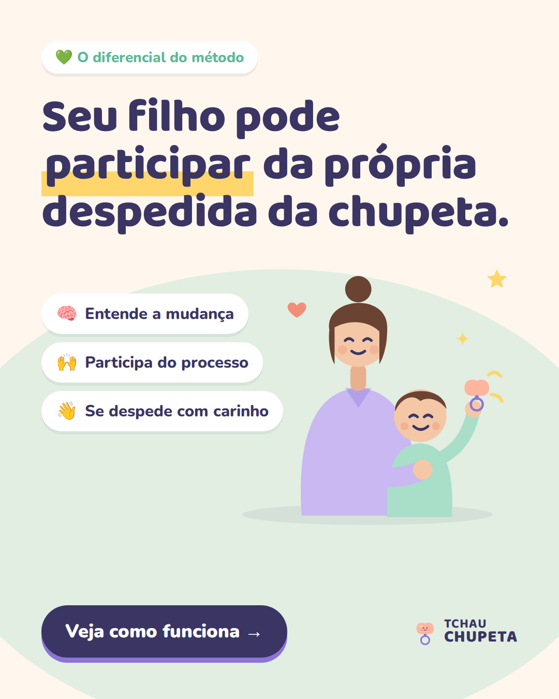

- **Texto principal:**
  > Seu filho pode participar da própria despedida da chupeta. 👋
  >
  > Em vez de a chupeta simplesmente "sumir", o Tchau Chupeta ajuda você a criar uma narrativa de despedida — para a criança entender a mudança e fazer parte dela.
  >
  > Quando a criança participa, a retirada deixa de ser algo que os adultos fizeram com ela e passa a ser um momento vivido junto.
  >
  > Veja como funciona 💚
- **Título:** Seu filho pode participar desse momento
- **Descrição:** A despedida da chupeta pode ser mais leve
- **Botão:** Saiba mais

### feed-06 — Ângulo "Passo a passo"
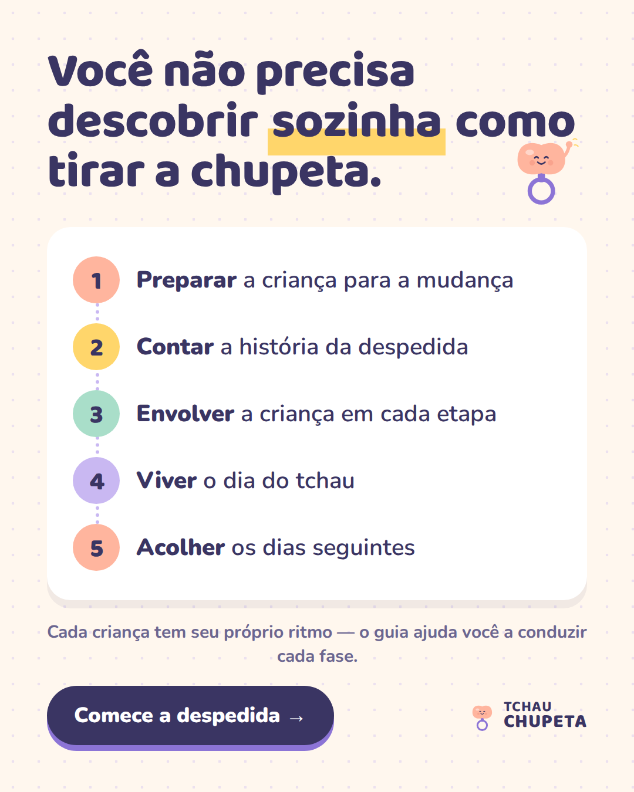

- **Texto principal:**
  > Você não precisa descobrir sozinha como tirar a chupeta. 🧭
  >
  > O Tchau Chupeta organiza a despedida em etapas: preparar a criança, contar a história da despedida, envolver seu filho, viver o dia do tchau e acolher os dias seguintes.
  >
  > Você sabe o que fazer em cada fase — e respeita o ritmo do seu filho.
  >
  > Comece a despedida 👉
- **Título:** O passo a passo para conduzir essa transição
- **Descrição:** Guia digital para pais e mães
- **Botão:** Saiba mais

> ⚠️ **Ajuste necessário:** as 5 etapas do feed-06 foram escritas a partir do mecanismo descrito no briefing. Troque pelos nomes reais dos módulos/etapas do produto em `src/build.mjs` (constante `steps`) e rode o build de novo.

### feed-07 — Estrutura completa (Hook → Problema → Nova perspectiva → Produto → CTA)
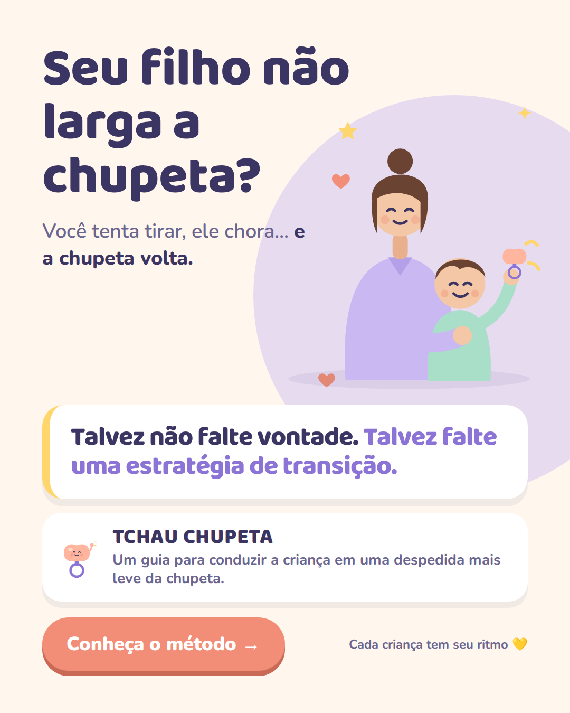

- **Texto principal:**
  > Seu filho não larga a chupeta? 🤍
  >
  > Você tenta tirar, ele chora… e a chupeta volta.
  >
  > Talvez não falte vontade. Talvez falte uma estratégia de transição.
  >
  > O Tchau Chupeta é um guia para conduzir a criança em uma despedida mais leve da chupeta — com preparação, participação e acolhimento.
  >
  > Conheça o método 👉
- **Título:** Seu filho não larga a chupeta?
- **Descrição:** Uma despedida mais leve é possível
- **Botão:** Saiba mais

---

## 3. Stories / Reels (9:16)

As peças respeitam as áreas seguras (250 px no topo e 340 px na base livres de texto importante).

| Peça | Ângulo | Texto principal sugerido |
|---|---|---|
| 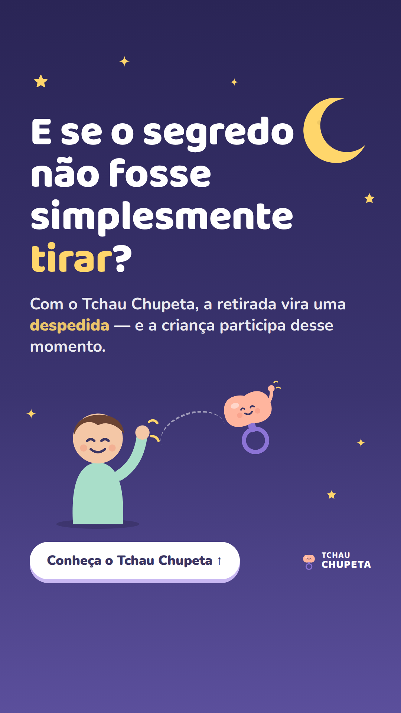 | A despedida | "E se o segredo não fosse simplesmente tirar? 🌙 Conheça o Tchau Chupeta." |
| 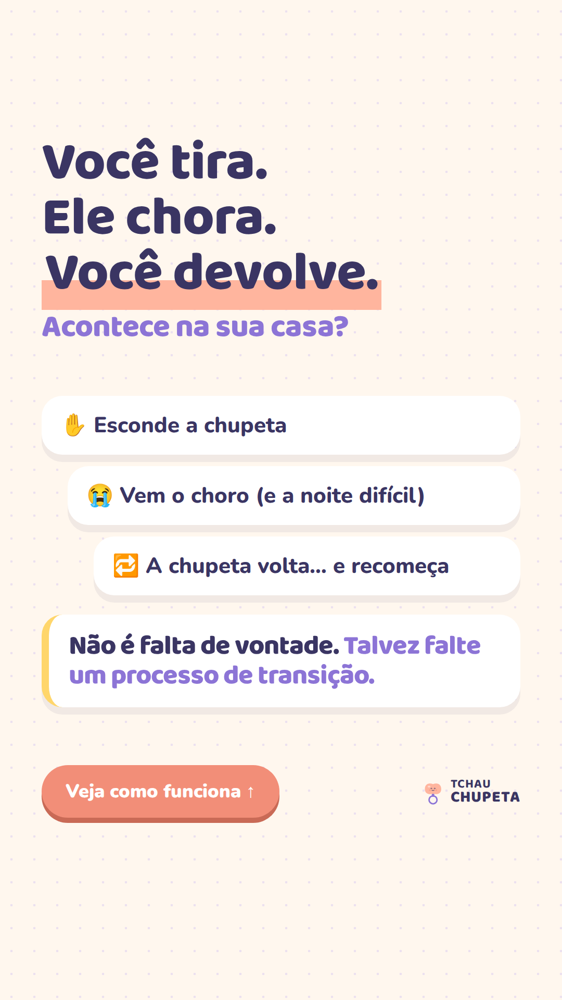 | Tentativa frustrada | "Tira, chora, devolve… Acontece aí? Veja uma forma mais estruturada de conduzir a despedida." |

---

## 4. Carrossel (6 slides)

| 1 | 2 | 3 |
|---|---|---|
| 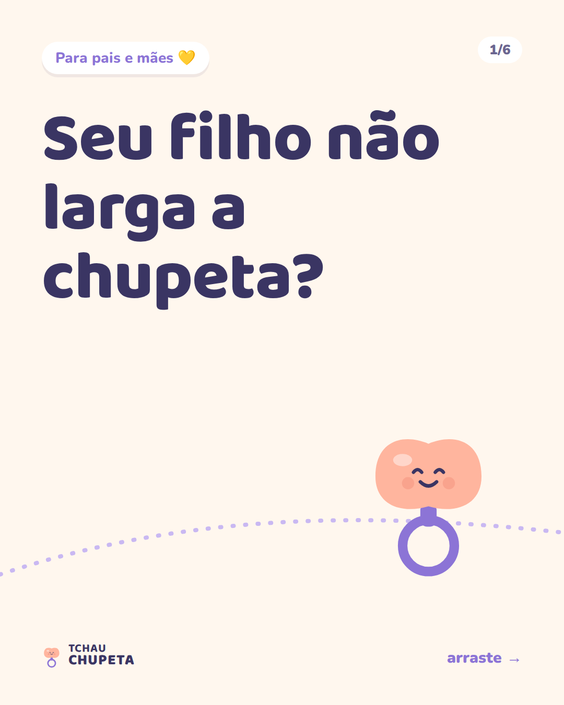 |  | 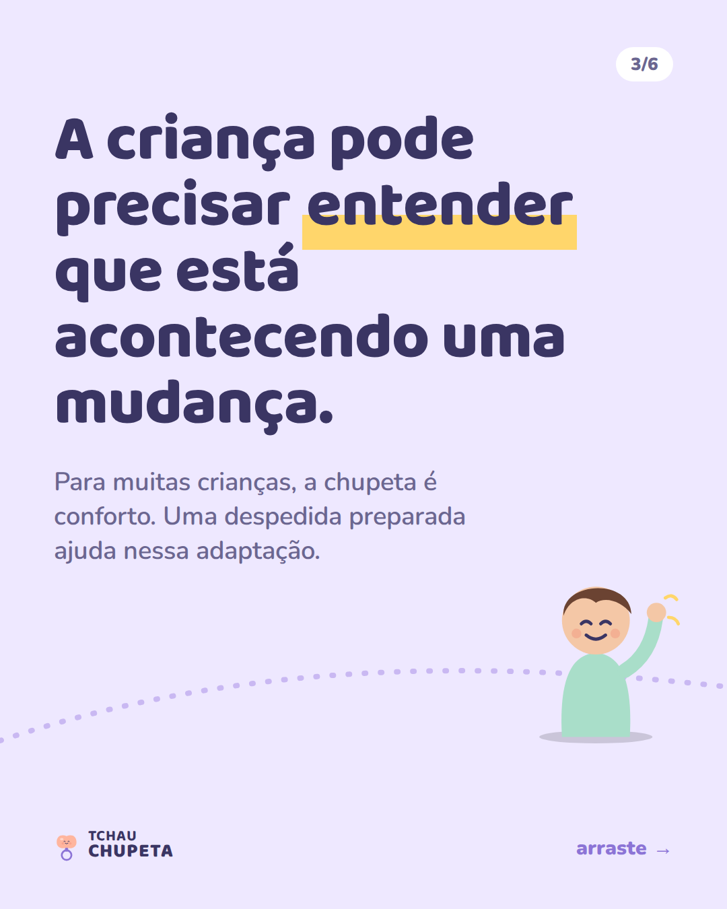 |
| **4** | **5** | **6** |
| 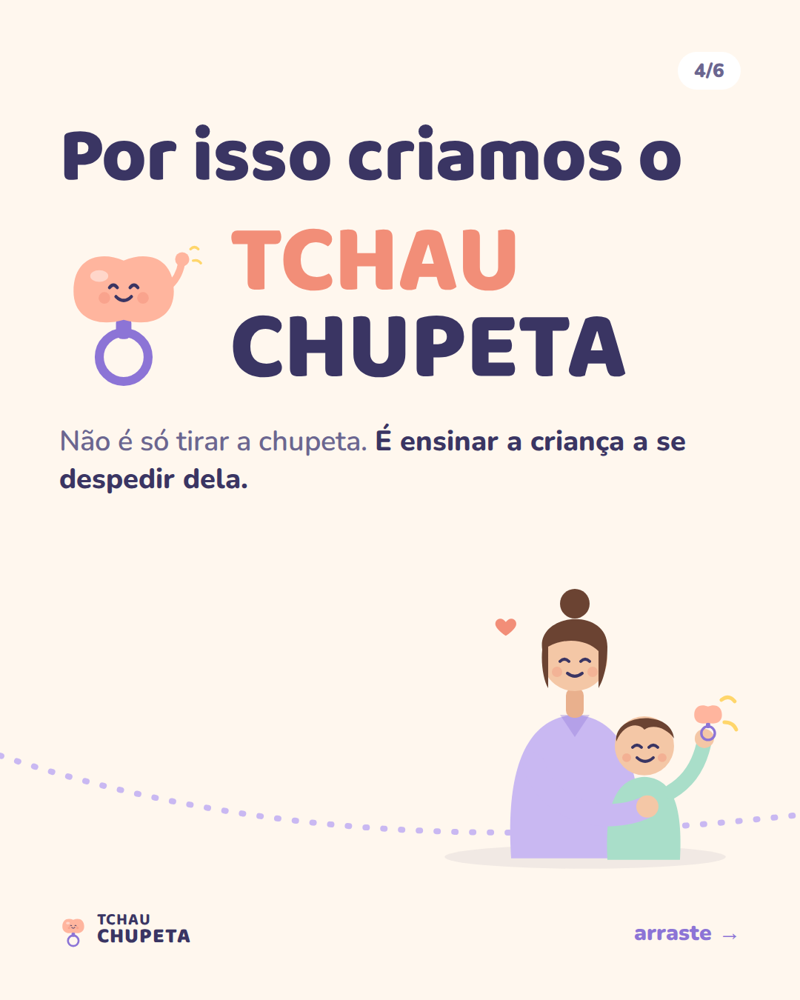 | 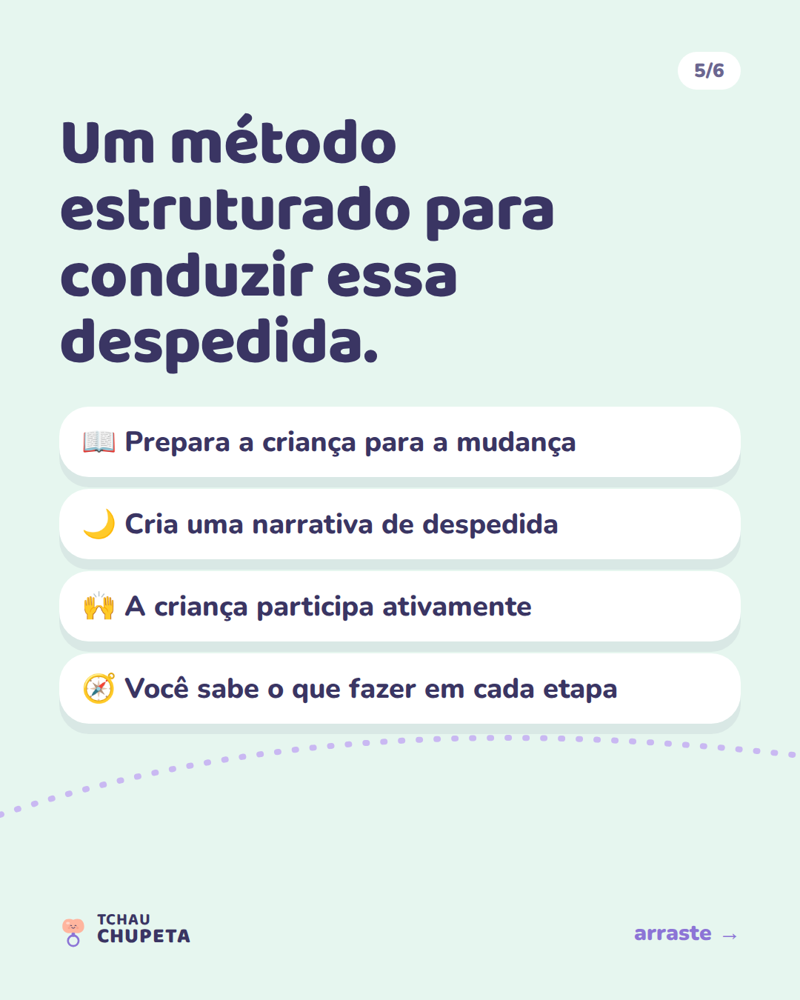 |  |

A trilha pontilhada atravessa os slides e dá continuidade ao arrastar.

- **Legenda/Texto principal:**
  > Seu filho não larga a chupeta? Arraste para o lado 👉
  >
  > Talvez simplesmente tirar não seja a melhor forma de começar. Muitas crianças precisam entender que uma mudança está acontecendo.
  >
  > Foi por isso que criamos o Tchau Chupeta: um passo a passo para transformar a retirada da chupeta em uma despedida — mais lúdica, acolhedora e estruturada.
  >
  > Cada criança tem seu ritmo. 💛 Toque em "Saiba mais".
- **Título:** Conheça o Tchau Chupeta
- **Botão:** Saiba mais

---

## 5. Roteiros de vídeo (UGC — mãe falando para a câmera)

Formato: 9:16, 25–40 s, gravado no celular, luz natural, ambiente real da casa (sala/quarto infantil). Legendas grandes na tela (palavras-chave em amarelo). Nada de roupa de "médica" ou cenário de consultório.

### UGC 1 — "Eu achava que era só esconder" (roteiro do briefing)

| Tempo | Fala (câmera frontal) | Texto na tela / cena |
|---|---|---|
| 0–3 s | "Eu achava que pra tirar a chupeta do meu filho era só esconder…" | Mão mostrando a chupeta e escondendo na gaveta. Texto: **"era só esconder…"** |
| 3–9 s | "Até perceber que toda vez que eu fazia isso ele chorava… e eu acabava devolvendo." | Texto: **"tira → chora → devolve 🔁"** |
| 9–16 s | "Foi quando conheci uma abordagem diferente." | Olhar mais leve, sorriso. Texto: **"uma abordagem diferente"** |
| 16–26 s | "Em vez de simplesmente tirar, o processo ajuda a criança a participar da despedida. Ela entende que tá acontecendo uma mudança." | Cena da criança acenando "tchau" para a chupeta (sem mostrar rosto, se preferir). Texto: **"a criança participa da despedida 👋"** |
| 26–32 s | "Esse é o Tchau Chupeta. É um passo a passo pra conduzir esse momento com mais calma. Cada criança tem seu tempo, mas agora eu sei o que fazer." | Tela do produto no celular. Texto: **"Tchau Chupeta — link aqui 👇"** |

### UGC 2 — "Cansada de ouvir 'me dá a chupeta'"

| Tempo | Fala | Texto na tela / cena |
|---|---|---|
| 0–3 s | (voz de criança em off, ou só texto) "Mãe, me dá a chupeta…" → mãe olha para a câmera, cansada e bem-humorada. | Texto: **"pela 15ª vez hoje…"** |
| 3–10 s | "Se aqui na sua casa também é assim, eu te entendo. Eu queria tirar, mas não fazia ideia de por onde começar." | Texto: **"não sabia por onde começar"** |
| 10–20 s | "O que mudou pra mim foi entender que não é só tirar a chupeta. É ensinar a criança a se despedir dela." | Texto grande: **"não é só tirar. é se despedir."** |
| 20–30 s | "O Tchau Chupeta mostra etapa por etapa: como preparar, como fazer a despedida e como acolher nos dias seguintes." | Mostrar as etapas no celular / checklist. |
| 30–35 s | "Se você tá nessa fase, dá uma olhada no link." | Texto: **"conheça o Tchau Chupeta 👇"** |

### UGC 3 — "O pai que queria ajudar" (variação com pai, para diversificar público)

| Tempo | Fala | Texto na tela / cena |
|---|---|---|
| 0–3 s | "Aqui em casa cada um falava uma coisa sobre a chupeta… e quem ficava confuso era ele." | Texto: **"cada adulto falava uma coisa 😅"** |
| 3–12 s | "A mãe escondia, a avó devolvia, eu não sabia o que fazer. Não tinha como dar certo assim." | Texto: **"sem combinado, sem constância"** |
| 12–24 s | "Com o Tchau Chupeta a gente passou a seguir o mesmo passo a passo. E o mais legal: nosso filho participou da despedida." | Família reunida; criança acenando. Texto: **"todo mundo no mesmo passo a passo"** |
| 24–30 s | "Se sua família também tá nessa, vale conhecer." | Texto: **"link aqui 👇"** |

> **Importante nos UGCs:** se forem gravados com atrizes/atores, não apresentar como depoimento real de cliente. Se forem depoimentos reais, use apenas relatos autorizados e sem prometer resultados ("em 1 dia", "sem choro").

### Vídeo narrado (motion com o mascote Chupi) — 20 s

1. **(0–3 s)** Chupi aparece na tela, olhando para a câmera. Locução: *"Oi! Eu sou a chupeta do seu filho."*
2. **(3–8 s)** *"E sabe o que acontece quando me escondem de repente? Choro, birra… e eu acabo voltando."* (ícones do ciclo 🔁)
3. **(8–14 s)** *"Mas existe outro jeito: preparar a criança e deixar ela participar da nossa despedida."* (criança acenando, céu com estrelas)
4. **(14–20 s)** Chupi acena e sobe em direção à lua. *"Tchau Chupeta. Um passo a passo para uma despedida mais leve. Toque em Saiba mais."*

---

## 6. Banco de hooks (para testes A/B)

**Identificação / dor**
1. Seu filho não larga a chupeta?
2. Você tira a chupeta. Ele chora. Você devolve. Acontece aí?
3. Se você está cansada de ouvir "me dá a chupeta" o dia inteiro, veja isso.
4. Você já escondeu a chupeta… e acabou devolvendo?
5. Você sabe que chegou a hora, mas tem medo das noites de choro?
6. Quer tirar a chupeta, mas não sabe o que fazer primeiro?
7. Na sua casa cada adulto fala uma coisa sobre a chupeta?
8. Seu maior medo é mexer na chupeta e bagunçar o sono?

**Nova perspectiva / curiosidade**
9. O erro pode estar em tirar a chupeta de uma hora para outra.
10. E se o segredo não fosse simplesmente tirar a chupeta?
11. Não é só tirar a chupeta. É ensinar a criança a se despedir dela.
12. Talvez não falte vontade. Talvez falte uma estratégia de transição.
13. Existe uma diferença entre "tirar" a chupeta e "se despedir" dela.
14. Seu filho pode participar da própria despedida da chupeta.

**Acolhimento / solução**
15. Você não precisa descobrir sozinha como tirar a chupeta.
16. A despedida da chupeta pode ser mais leve.
17. O passo a passo que eu queria ter tido quando fui tirar a chupeta.
18. Chega de brigar pela chupeta.
19. Uma nova forma de dizer tchau à chupeta.
20. Transforme a retirada da chupeta em uma despedida.

## 7. Headlines (campo "Título" do anúncio — até ~40 caracteres)

- Seu filho não larga a chupeta?
- Como começar a retirada da chupeta?
- Não sabe como tirar a chupeta?
- E se você não precisasse só tirar?
- Uma nova forma de dizer tchau à chupeta
- Transforme a retirada em despedida
- Seu filho pode participar desse momento
- Chega de brigar pela chupeta
- A despedida da chupeta pode ser mais leve
- O passo a passo para essa transição

## 8. Plano de testes A/B sugerido

Teste uma variável por vez. Orçamento igual por conjunto, mesmo público, 3–5 dias antes de decidir.

| Rodada | O que testar | Peças |
|---|---|---|
| 1 — Ângulo | Qual ideia gera mais clique | feed-01 (não é só tirar) × feed-02 (despedida) × feed-03 (ciclo) × feed-04 (mães cansadas) × feed-05 (criança participa) × feed-06 (passo a passo) |
| 2 — Formato | Com o ângulo vencedor | estático × carrossel × stories × UGC |
| 3 — Hook | Mesmo criativo, 3–5 hooks diferentes no texto principal / primeiros 3 s do vídeo | hooks da seção 6 do mesmo grupo do ângulo vencedor |
| 4 — CTA | Texto do botão da peça | "Veja como funciona" × "Conheça o método" × "Comece a despedida" |

Métricas para decidir: CTR (link), custo por clique, taxa de retenção de 3 s (vídeo) e, principalmente, custo por compra.

## 9. Checklist de conformidade (antes de subir)

- [ ] Sem promessas absolutas: nada de "100%", "garantido", "funciona com qualquer criança", "em 1 dia", "sem choro".
- [ ] Sem "método comprovado" e sem alegações médicas/odontológicas sem evidência.
- [ ] Sem linguagem de culpa ou medo ("você está prejudicando seu filho", "seu filho está viciado", "depois será tarde").
- [ ] Preferir: "pode ajudar", "uma forma de conduzir", "passo a passo", "cada criança tem seu próprio ritmo".
- [ ] Depoimentos só se forem reais e autorizados; atores não devem ser apresentados como clientes.
- [ ] Conferir se as etapas do feed-06 e do carrossel batem com o conteúdo real do produto.

---

## 10. Página de vendas

`pagina-vendas/index.html` — página longa (mobile-first) na identidade visual dos criativos, com o mascote Chupi e as fontes locais em `pagina-vendas/fonts/`. Para publicar, suba a pasta `pagina-vendas/` inteira na hospedagem.

**Antes de publicar**, edite o bloco `OFERTA` no topo de `src/pagina.mjs` e rode `node src/pagina.mjs`:

| Campo | O que colocar |
|---|---|
| `checkout` | Link do checkout (UTMs do anúncio são repassadas automaticamente) |
| `preco` / `precoDe` / `parcelas` | Valores reais (hoje aparece `R$ XX,XX`) |
| `garantiaDias` | Prazo de garantia (7 = mínimo legal do CDC) |
| `formato` | Formato real do produto (PDF, área de membros…) |
| `bonus` | Bônus reais, se houver (a lista só aparece se estiver preenchida) |
| `pixelMeta` | ID do Pixel da Meta (dispara PageView e ViewContent ao abrir e InitiateCheckout no clique, com valor em BRL) |

**Estrutura e gatilhos**

| # | Seção | Gatilho |
|---|---|---|
| 1 | Hero: "Não é só tirar a chupeta. É ensinar seu filho a se despedir dela." | Big Idea + curiosidade |
| 2 | Checklist "Marque o que acontece aí" (responde conforme o nº marcado) | Identificação + microcompromisso |
| 3 | O ciclo tira → chora → devolve | Inimigo comum + alívio de culpa |
| 4 | Tirar × Se despedir | Contraste / mecanismo único |
| 5 | Apresentação do produto | Solução |
| 6 | As 5 etapas | Especificidade |
| 7 | "Agora imagine" | Futuro desejado |
| 8 | 3 erros que mantêm o ciclo | Reciprocidade (entrega valor antes) |
| 9 | É / não é para você | Exclusividade + qualificação |
| 10 | Oferta com empilhamento do que recebe | Valor percebido + urgência honesta |
| 11 | Garantia | Reversão de risco |
| 12 | FAQ | Quebra de objeções |
| 13 | "Caminho 1 × Caminho 2" | Escolha / fechamento emocional |

Barra de CTA fixa no celular (some na seção de oferta).

> 🔒 **Token da API de Conversões:** nunca coloque na página (o HTML é público). Ele vai na integração de Pixel da plataforma de checkout (Kiwify, Hotmart…), que envia o evento **Purchase** pelo servidor.

**Publicação:** o projeto `pagina-vendas` na Vercel está ligado a este repositório (Root Directory `tchau-chupeta/pagina-vendas`). Rode `node src/pagina.mjs`, faça commit e push na branch de produção, e o site atualiza sozinho.

> ⚠️ **Confirmar:** as 5 etapas e os 4 itens da oferta seguem o mesmo mecanismo suposto do feed-06 — troque pelos módulos reais. A seção de **depoimentos** está comentada no HTML: só ative com relatos reais e autorizados. Não há contador regressivo nem escassez falsa, de propósito.

---

## 11. Página B (teste A/B) — `/b`

`pagina-vendas/b/index.html`, publicada em **tchauchupeta.vercel.app/b**. Gerada por `node src/pagina-b.mjs`. Preço, checkout e Pixel ficam em `src/oferta.mjs`, compartilhado com a página A: altere uma vez e rode os dois geradores.

**Ângulo:** a própria chupeta (Chupi) pede uma despedida — “Eu não quero sumir. Eu quero me despedir.”

| # | Seção | Gatilho |
|---|---|---|
| 1 | A chupeta fala (balão) | Curiosidade + quebra de padrão |
| 2 | Carta da chupeta | Storytelling + empatia + alívio de culpa |
| 3 | Contador de “me dá a chupeta” (slider) | Especificidade + custo de continuar igual |
| 4 | Diagnóstico de 3 perguntas | Personalização + microcompromisso |
| 5 | Mitos × verdades | Quebra de objeções |
| 6 | Antes / durante / depois | Mecanismo |
| 7 | Escolha a data do tchau | Compromisso e coerência (a data aparece na caixa da oferta) |
| 8 | Oferta “menos de R$ 1 por dia” | Ancoragem de preço |
| 9 | “7 dias para testar” | Reversão de risco |
| 10 | P.S. e P.P.S. | Fechamento em formato de carta |

Botões: cada um leva à seção seguinte; só os da oferta e do P.S. abrem o checkout.

**Medição do teste:** os eventos do Pixel levam `content_category` = `pagina-a` ou `pagina-b`. A página B também envia os eventos personalizados `QuizConcluido` e `DataEscolhida`. Nos anúncios, use a mesma campanha com dois links (`/` e `/b`) e `utm_content=pagina-a` / `utm_content=pagina-b` para a Kiwify separar as vendas.
